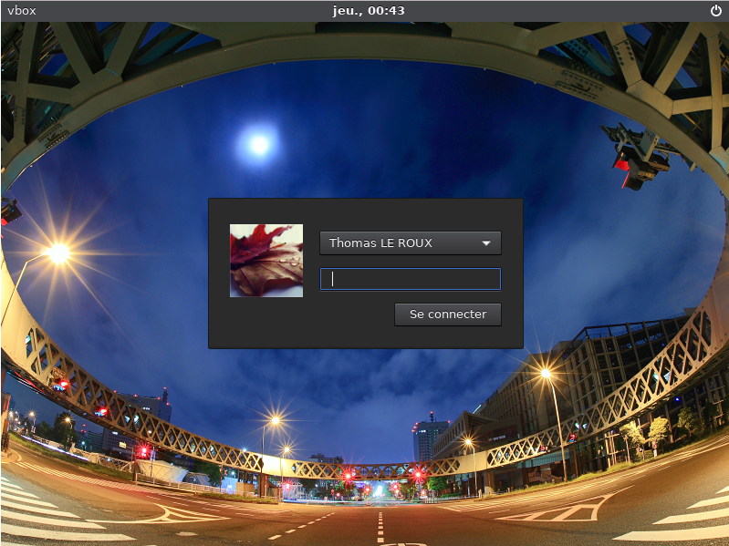
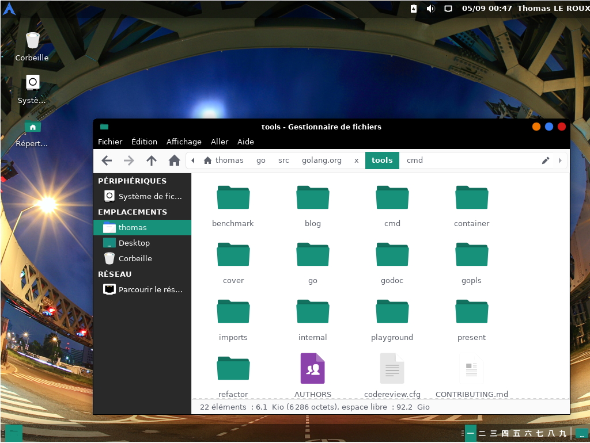

# Kiss my Arch'

Oh :open_mouth: !

Hello fellow _voyager_, it seems that you've come a long way to be here...

Here! Take this :beer:, cheers!

## Where am I?

Well, it's my warehouse for anything related to **Arch Linux**.

I've used Arch' since 2009 _(Oh my god, it's been a while...)_ and since I love automation, this repository contains my personal touch for Arch Linux.

### Bootstrap

**Bootstrap** is a list of Arch Linux installers that I use for a fresh install. These configurations are available:

 * Dell XPS 13 9333 _(hardware)_
 * Dell XPS 13 9360 _(hardware)_
 * VirtualBox _(software)_

**However**, it will configure a minimal system. That's why I use Ansible...

### Ansible

Once you had a minimal operating system following the **[Official Guide](https://wiki.archlinux.org/index.php/Installation_guide)** or using one of my **Bootstrap**, it's time for automation! :rocket:

I use **Ansible** for this purpose and everything I need for a perfect Arch Linux experience is defined as playbook.

For a straightforward installation, configure your `hosts` file using `hosts.example` as a template and execute:

```
$ ansible-playbook playbook/install.yml
```

:sparkles: **Magic!** :sparkles:

> **NOTE:** Don't hesitate to edit the configuration file located at `ansible/playbook/conf/common.yml`

## Screenshots






## Online resources

> `elinks https://novln.github.io/Kiss-my-Arch/`
